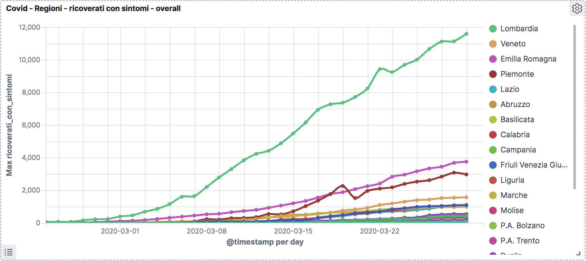

# COVID-19-italy-elk
_ELK files to be used with italian COVID-19 data_


### References

This is the [official italian COVID-19 repository](https://github.com/pcm-dpc/COVID-19) provided by **Protezione Civile** used as data source for this tools.


### How-To

* clone data source repository in your own **path**

` git clone https://github.com/pcm-dpc/COVID-19`

* clone this repository or download logstash config file

* edit _path_ in the _input_ section and specify the location where you downloaded the repository before

```
input {
  file {
    path => [ 
      "/repository/COVID-19/dati-province/dpc-covid19-ita-province-20*.csv",
      "/repository/COVID-19/dati-regioni/dpc-covid19-ita-regioni-20*.csv",
      "/repository/COVID-19/dati-andamento-nazionale/dpc-covid19-ita-andamento-nazionale-20*.csv"
    ]
    start_position => "beginning"
  }
}
```

* edit the _output_ section as you wish; the commented line is for debug purposes

```
output {
#  stdout { codec => rubydebug }
  elasticsearch {
    hosts => ["localhost:9200"]
    index => "covid-%{+YYYY.MM.dd}"
  }
}
```

* run Logstash to index data on Elasticsearch


### Notes

* added population dictionaries

```
*  popolazione_nazionale.csv
* popolazione_province.csv
* popolazione_regioni.csv
```


### Examples

Here is an example of what you can do with Kibana once the data is indexed in Elasticsearch:


